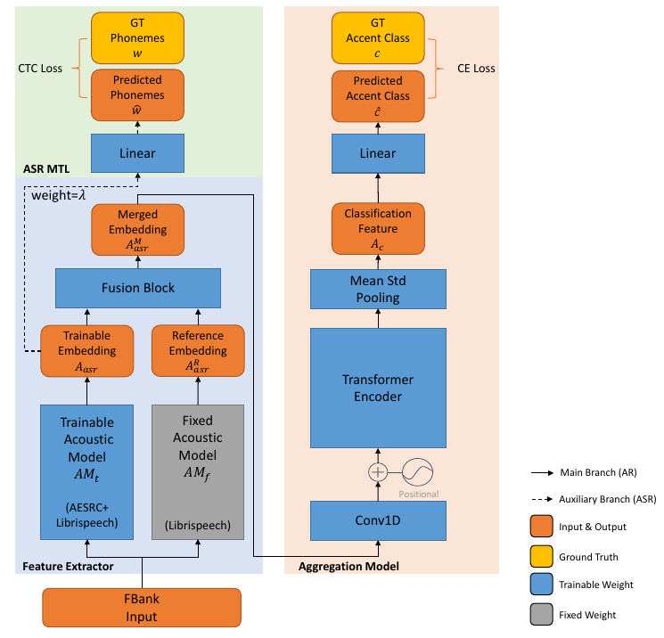

# Accent Recognition with Hybrid Phonetic Features

## Structure

We use hybrid phonetic features along with the ASR multi-task learning to boost the performance of accent recognition. The Jasper acoustic model is used to extract the phonetic information while the Transformer encoder is used to aggregate the learned feature for accent classification.

# Required Packages

Please install `pytorch-lightning`, `espnet`, `torchmetric` to run the code.

## Training

To train the model or check the performance, please download the model (in the release) checkpoint and modify `checkpoint` in the main solver code file. To see the effect of different fusion methods, modify the `fusion` parameter in the config file.